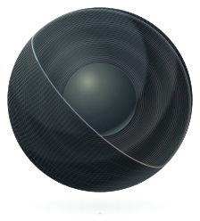

<p align="center">
  <a href="docs/assets/brand/mantle-globe-preview.png">
    
  </a>
</p>

<h1 align="center">mantle</h1>
<p align="center"><em>File-system and object store for exabyte scale.</em></p>

Your agents make things that outlive the run that made them: checkpoints, transcripts,
datasets, embeddings, the outputs of a thousand parallel attempts at the same problem.
Mantle is where those things go. It speaks the S3 API, so the tools your agents and
pipelines already use (the AWS CLI, boto3, the AWS SDKs, rclone and everything built on
them) store and fetch from it unchanged. An agent puts an object and reads it back, lists
what its peers wrote under a prefix, uploads a dataset of any size in parts and picks up
where a dropped connection left off, and deletes what it no longer needs.

When mantle says it has your object, it has it. The bytes are on disk, on every machine
the write needs, before the request returns, and the next read sees them. Two agents
racing to create the same key cannot both win, so the store itself can settle who owns a
piece of work. Every byte is checked against a checksum from the moment it arrives to the
moment it is read back, and a copy that fails its check is replaced from another one
instead of being handed to you.

Mantle runs as one process on your laptop and as thousands of machines holding exabytes,
and both are the same program. It is built the way Meta built Tectonic, the filesystem
that holds Facebook's exabytes: the machines that own the disks store the pieces, a
replicated metadata service knows where every piece lives, and a large object is cut into
erasure-coded pieces that go straight to their disks, so no object has to squeeze through
a single server.

**Your disks are measured, not believed.** What an operating system says about a disk is
a claim, and it is often wrong. Inside Docker Desktop on the Mac this README was written
on, Linux calls the laptop's flash a spinning disk and reports 1.88 TB free on a machine
with 24 GB left. Before mantle keeps anything on a disk it asks the OS what the disk is,
then measures what it actually does through the same path your data will take, and sizes
its reads, writes and commits to what it measured. You can ask it the same question:

```console
$ mantle disk probe ~/mantle-data --measure
~/mantle-data
  disk          APPLE SSD AP8192Z, internal flash
  file system   APFS, 50.6 GB free
  safety        the drive does not say whether it caches writes, so every commit empties its cache
measuring with a scratch file of up to 268 MB, removed afterwards...
measured in 13 s:
  reads         fastest with 64 small reads in flight, so mantle keeps up to 64 in flight
  throughput    13.9 GB/s reading and 22.2 GB/s writing large transfers
  commits       about 4.72 ms until a write is safe; writes that arrive together share one commit
```

This drive will not say whether it holds writes in a cache, so mantle makes it empty the
cache on every commit, and on this laptop that takes about five milliseconds. Paying it
once per write would cap the machine at a couple of hundred safe writes a second. Mantle
pays it once per batch instead: every write that arrives while one commit is in progress
becomes safe with the next.

> [!NOTE]
> The output above was captured from a release build on an Apple M5 Max running macOS 26,
> with the home directory shortened.

> [!IMPORTANT]
> Mantle has no release yet. Today you can run `mantle disk probe`, and underneath it
> sits what every later layer stands on: device identification on Linux, macOS and
> Windows, a direct-I/O file layer that makes data safe the way each platform actually
> requires, and end-to-end checksums. The chunk store comes next, then erasure coding,
> the replicated metadata service, and the S3 gateway with the full API your tools use:
> multipart uploads and resuming them, puts, gets, deletes, copies, listings, versioning,
> conditional requests and checksums. [docs/STATUS.md](docs/STATUS.md) tracks each piece
> and what closes it.

## Install

Until the first release, build from source. You need Rust 1.98, which the toolchain file
pins, so `rustup` picks it up:

```sh
git clone https://github.com/hyper-light/mantle && cd mantle
cargo build --release -p mantle --locked
sudo mv target/release/mantle /usr/local/bin/   # or add target/release to your PATH
mantle --help
```

Mantle builds and passes its tests on Linux, macOS and Windows, on x86_64 and arm64.

## Quickstart

Point mantle at the directory you would keep data in:

```sh
mantle disk probe ~/mantle-data
```

It answers at once from what the operating system reports: which drive holds the
directory, what it is made of, how much room is left, and what mantle will have to do to
make a write safe on it. Add `--measure` when you want the truth instead of the claim.
Mantle writes a scratch file there, never more than 256 MB or a tenth of the free space,
measures reads, writes and commits for a few seconds, and removes the file however the
run ends. Add `--verbose` to see every question the operating system could not answer,
and why.

## How it works

This is the design the code is being built to; [STATUS.md](docs/STATUS.md) says which
parts run today.

**Why an answered write survives a power cut.** Mantle answers a write only after the
disk reports the bytes on stable media, using the one call on each platform that means
that: `fdatasync` on Linux, `F_FULLFSYNC` on macOS, where a plain `fsync` leaves data in
the drive's cache, and `FlushFileBuffers` on Windows. If that call ever fails, mantle
stops trusting the disk instead of trying again, because a failed flush can leave the
kernel believing data is safe that never reached the platter.

**Why safe writes are still fast.** A disk commit costs the same whether it covers one
write or ten thousand, so each disk has one loop that commits everything that arrived
while the last commit was running. Mantle owns the path from memory to the device: one
large file or raw device per disk, written front to back in segments, with the operating
system's cache out of the way. Spinning disks, flash, and zoned drives all get the long
sequential writes they are fastest at.

**Why a bad disk cannot hand you bad bytes.** Every record on disk carries the identity
of the object piece it holds and a checksum over each 64 KiB, and a second copy of that
identity lives in a separate log. A misdirected write, a write the drive silently dropped,
and a flipped bit all fail one of those checks. A read that fails is treated as a missing
copy: it is served from another machine and repaired. A disk that fails once is watched
more closely, because failures cluster.

**Why listing a bucket stays fast at any size.** Object names are kept in key order,
split into ranges that each replicate on their own and split again when they grow large
or busy, the way S3 itself scales by prefix. Listing is a scan, not a search. Where each
piece of an object lives is kept apart from its name, so repairing a failed disk rewrites
locations without touching your namespace.

**Why a failed machine costs you nothing.** Large objects are erasure-coded: cut into
pieces plus parity so any sufficient subset rebuilds the whole, and spread across racks.
Small objects are copied three ways as they arrive and re-coded once their block fills.
When a disk dies, mantle rebuilds the pieces with the least redundancy left first.

The design is in [docs/design/](docs/design/), starting with the
[chunk store](docs/design/chunk-store.md), and the research every decision cites is in
[docs/research/](docs/research/).

## From a laptop to a fleet

Your agents might write to one laptop today, a rack next quarter and several regions
after that. The S3 calls they make do not change at any step, and you never choose a
shard count or a split key. You say how much hardware a write must survive, and mantle
places each object's pieces so that it does, and tells you when your hardware cannot.
What changes as you grow is what a write waits for:

| You run mantle on | A write is answered once | What you can lose |
|---|---|---|
| One disk | it is on that disk | Nothing: lose the disk and you lose the data, and mantle says so when it starts |
| One machine with several disks | its pieces are on separate disks | Any disk its layout was chosen to survive |
| Many machines | its pieces are on disks in separate racks | Whole machines and racks, as many as you asked it to survive |
| Several zones | its pieces are spread across zones | A zone, with the cross-zone round trip in every write |

Metadata follows the same rule: each range of names is replicated by consensus across the
failure domains you name, on the Raft core mantle shares with
[focal](https://github.com/hyper-light/focal), including its fast track that saves a
round trip when a write starts away from the leader.

## Documentation

| Doc | What's in it |
|---|---|
| [Status](docs/STATUS.md) | What runs today, and what closes each remaining piece |
| [Chunk store](docs/design/chunk-store.md) | How mantle writes bytes to a device, recovers after a crash, and reclaims space |
| [Research](docs/research/) | The papers and platform documentation each decision rests on |
| [Measurements](docs/measurements/) | What mantle measured on real hardware, and what each result changed |
| [Bugs](docs/bugs/) | Every defect found, its cause, and the test that keeps it fixed |

## Contributing / development

```sh
bash scripts/gates.sh            # every gate below, in order; stops at the first failure
bash scripts/check-targets.sh    # lint all six platform targets from one machine
bash scripts/linux-test.sh       # run the tests on Linux in a container
```

The rules every change follows are in [CLAUDE.md](CLAUDE.md): production code never
panics, every queue and cache has a bound, every design decision cites its evidence, and
every claim about performance names the run that measured it.

## Acknowledgements

Mantle's architecture follows Pan et al.'s Tectonic (FAST '21). Its storage layer draws
on Haystack and f4 for keeping many objects in few large files, on Rosenblum and
Ousterhout's log-structured file system for reclaiming them, and on BlueStore's lesson
that a storage system should own its disks. Its consensus core comes from
[focal](https://github.com/hyper-light/focal), and its engineering rules from focal and
[slates](https://github.com/hyper-light/slates).

## License

MIT — © 2026 Hyperlight. See [LICENSE](LICENSE).
